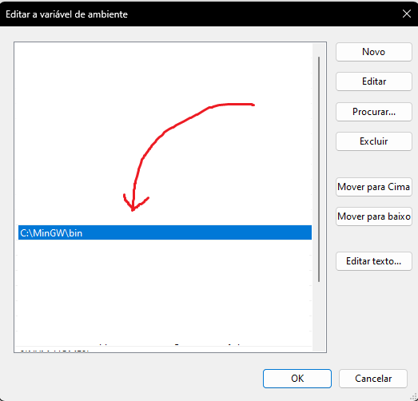

# C

C é uma linguagem de programação poderosa e amplamente utilizada, principalmente para o desenvolvimento de sistemas e software de baixo nível.

Ele possui diversas opções de compilação (pois não oferece nenhuma nativamente). A nossa sugestão é o GCC da MinGW.

## Instalação do GCC

### Windows

No Windows, a maneira mais comum de instalar o compilador GCC é através do MinGW. Siga os passos abaixo para instalar:

1. Baixe o MinGW no site da SourceForge: [MinGW](https://sourceforge.net/projects/mingw/).
2. Durante a instalação, selecione a opção "mingw32-gcc-g++" para instalar o GCC.
3. Adicione o diretório `bin` do MinGW ao `PATH` do sistema.

Exemplo de variável de ambiente (foi o nosso caso, mas pode variar):


### Linux

Em distribuições Linux, o GCC geralmente já vem pré-instalado. Caso não esteja, você pode instalar usando o gerenciador de pacotes da sua distribuição:

```sh
sudo apt-get install gcc   # Para distribuições baseadas em Debian/Ubuntu
sudo yum install gcc       # Para distribuições baseadas em Red Hat/Fedora
```

### MacOS

No MacOS, o GCC pode ser instalado através do Homebrew:

```sh
brew install gcc
```

## Verificar Instalação

Para verificar se o GCC está instalado corretamente, execute o seguinte comando no terminal:

```sh
gcc --version
```

## Compilação e Execução

1. Navegue até o diretório onde o arquivo `.c` está localizado.
2. Compile o arquivo com o seguinte comando:

```sh
gcc hello.c -o hello
```

3. Execute o arquivo compilado com:

```sh
./hello
```

### Compilação Online

Você também pode utilizar um compilador C online, como o:

[JDoodle C Compiler](https://www.jdoodle.com/c-online-compiler)

[GDB Online Compiler](https://www.onlinegdb.com/online_c_compiler)
