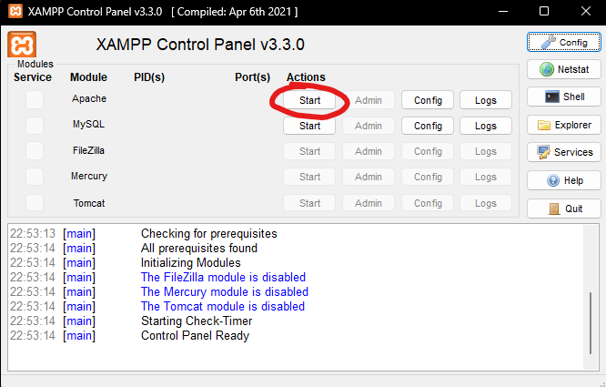

# PHP

PHP é uma linguagem de programação amplamente utilizada para desenvolvimento web. Ele precisa de um servidor web para executar, o que normalmente seria problemático e demorado de aprender, mas podemos contornar isso com o XAMPP.

## Instalação e Configuração do XAMPP

A maneira mais fácil de configurar um ambiente PHP é utilizando o XAMPP, que inclui o Apache, PHP e MySQL.

### Windows, Linux & MacOS

1. Baixe e instale o XAMPP a partir do site oficial: [XAMPP Downloads](https://www.apachefriends.org/index.html).
2. Após a instalação, abra o painel de controle do XAMPP e inicie o Apache.

## Execução de Scripts PHP

1. Coloque seus arquivos `.php` na pasta `htdocs` dentro do diretório de instalação do XAMPP.
2. No navegador, acesse `http://localhost/nome_do_seu_arquivo.php` para executar o script.
